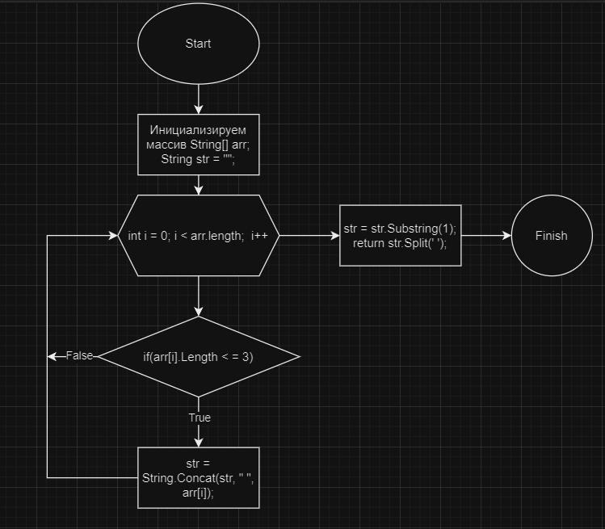

# Решение задачи

## Вступление
Вступление

## Ограничения
Мое решение подразумевает, что больших данных там не будет. Условие в этом не ограничивало, поэтому сделал как мог, без усложнений.

## Основная часть

### Визуальное решение

### Словесное решение
1. Создаем строковый массив
2. Создаем функцию, параметром которой будет строковый массив массив.
3. В ней создаем строку. Туда будем добавлять через пробел "понравившиеся" ячейки массива
4. Проходимся циклом по массиву и с помощью Concat добавляем в строку через пробел нужные ячейки
5. Возвращаем преобразование строки в массив, используя функцию Split
6. Выводим результат в консоль

## Заключение
1. Компиляция
2. \*Вуаля\*🎇
3. Все работает (пока мы не начали увеличивать массив или длину выбираемых ячеек)